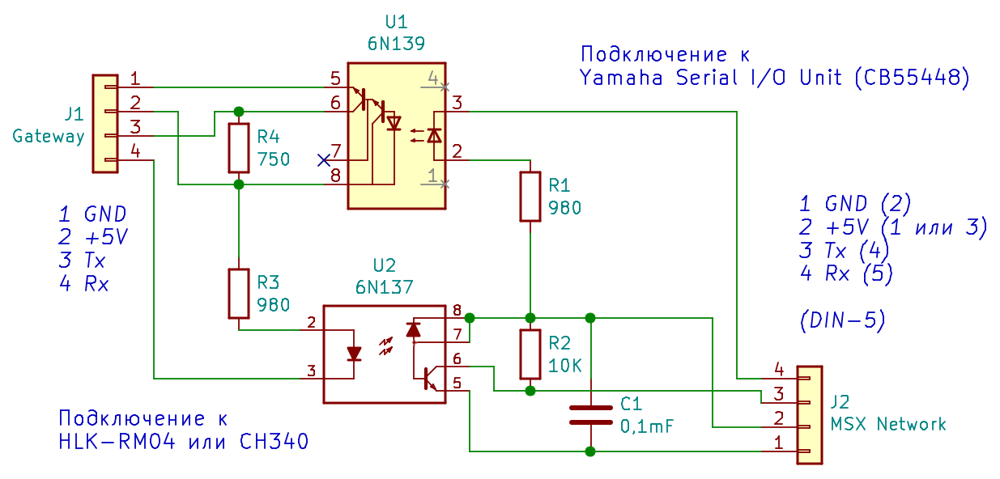

# MSX-Link

Организация сети между ПК и MSX c использованием технологии **Yamaha Локальная сеть, версия 3.0**. Подробнее о технологии [здесь](https://sysadminmosaic.ru/msx/yamaha_local_network).

## Описание
- **MSX-Link** — Программа которая запускается на ПК, эта программа берёт на себя роль "учителя" (№ 0 в сети)
- **MSX-Link-Gateway** — Шлюз между ПК с программой **MSX-Link** и сетью "студентов", схема [здесь](#gateway).
- **Сеть "студентов"** — сеть ученических машин:

  
За основу проекта взяты материалы их этих источников:
- [Сборка MSX-Link и его использование](http://cax.narod.ru/msx/msx-link/index.html), [оригинал изображения "гирлянда"](http://cax.narod.ru/msx/msx-link/img/other/garland.gif)
- [Описание протокола передачи в локальной сети КУВТ](http://www.sensi.org/~tnt23/msx/index.html)

## Возможности программы
- Отправка бинарных файлов длиной до 32 Кбайт
- Отправка программ на BASIC (во внутреннем формате)
- Приём программ на BASIC
- Отправка команд на BASIC
- Отправка сообщений
- Подключение ПК к шлюзу по USB или по Ethernet/Wi-Fi, смотри [схему](#gateway)

## Синтаксис 
`msx-link [-p №ПоследовательногоПорта ] [-s №Студента] [-<ключ>…] [_<команда>…]  [файл1] [файл2] […файлN]`

#### Параметры
 - `- i <хост>` — IP-адрес, или имя устройства которое является шлюзом к сети компьютеров MSX, значения по умолчанию нет
 - `- p 
`    — Соединиться с портом `
`, значение по умолчанию `1`, (рассматривать как номер IP-порта с при использовании ключа `-i`)
 - `- s <S>`    — С кем из "студентов" `<S>` работать, значение по умолчанию `-1`, возможные значения:
   - `-1`  — все
   - `0 `  — "учитель" (для тестового режима, ключ `-T`)
   - `1-15`  — диапазон "студентов"

#### Ключи
- `- c <команда>` — Отправить команду на BASIC "студенту(ам)" (макс. 37 символов) [аналогично `_SNDCMD  <команда>`]
- `- m <сообщение>` — Отправить `<сообщение>`  "студенту(ам)" `<S>`       (макс. 56 ) [аналогично `_MESSAGE <сообщение>`]
- `- C` — Отправить команду  `_cpm` "студенту(ам)" `<S>` для переключения в систему CP/M
-  `- S` — Отправить файл(ы) на сетевой диск CP/M (следует использовать с/после ключа `-C`)
- `- T` — Тестовый режим - дамп и ответ (линии RX и TX нужно поменять местами!)
- `- v [0-2]` — Вывод отладочной информации с указанием уровня детализации,  значение по умолчанию `0`
- `- h|H|?` — Вывод короткой справки по параметрам 

#### Команды
- `- _send <файл>` — Отправить файл на BASIC "студенту(ам)" `<S>` (файл должен быть в внутреннем формате MSX BASIC) [аналогично `_SEND <файл>`]
- `- _recv <файл>` — Получить программу на BASIC от "студента(ам)" `<S>` в <файл> [аналогично `_RECEIVE <файл>`]
- `- _run [№строки]` — Выполнить программу на BASIC у  "студента" `<S>`, можно задать номер строки с которой начнётся выполнение программы [аналогично `_RUN <№строки>`]
- `- _stop` — Остановить программу на BASIC у  "студента(ам)" `<S>` [аналогично `_STOP`]
- `- _sndcmd <команда>` — Отправить команду на BASIC "студенту(ам)" `<S>` (макс. 37 символов) [аналогично `_SNDCMD  <команда>`]
- `- _message <сообщение>` — Отправить сообщение "студенту(ам)" `<S>` (макс. 56 символов) [аналогично `_MESSAGE <сообщение>`]
- `- _cpm` — Отправить команду `_cpm` "студенту(ам)" `<S>` для переключения в систему CP/M

#### Список файлов
`[файл1] [файл2] […файлN]` — бинарные файлы (автоматически поддерживаются форматы BAS, BIN, ROM[8|16|32])

#### Пример 
`msx-link -p 0 -m "Hi all!"`

## Схема шлюза

### [Архив схемы в KiCad](https://github.com/mr-GreyWolf/MSX-Link/blob/master/scheme/MSX-Link-Gateway.zip)

## [Настройка HLK-RM04](https://github.com/mr-GreyWolf/MSX-Link/tree/master/HLK-RM04)
